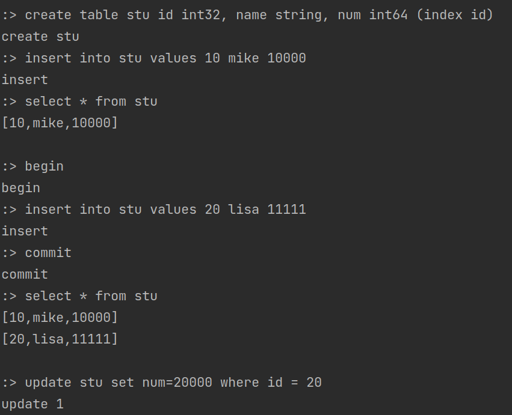
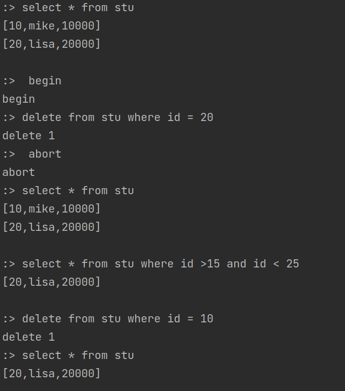

## MYDB
MYDB是一个Java语言实现的简易版数据库。

### 使用方式
```shell
# 首先将文件进行编译
mvn compile

# 服务端启动，会通过-create 参数以及 路径，在指定位置初始化文件
mvn exec:java -Dexec.mainClass="com.axuan.mydb.backend.Launcher" -Dexec.args="-create /tmp/mydb/mydb"

# 打开数据库，通过指定路径上的文件,默认是在9999端口启动，可更改
mvn exec:java -Dexec.mainClass="com.axuan.mydb.backend.Launcher" -Dexec.args="-open /tmp/mydb/mydb"

# 客户端启动(再打开一个终端)，随机使用一个端口，会与本地127.0.0.1:9999建立连接，进行通信
mvn exec:java -Dexec.mainClass="com.axuan.mydb.client.Launcher"
```
效果如下:


