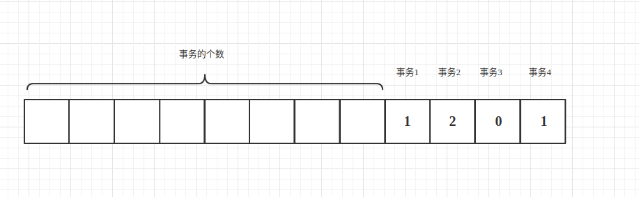
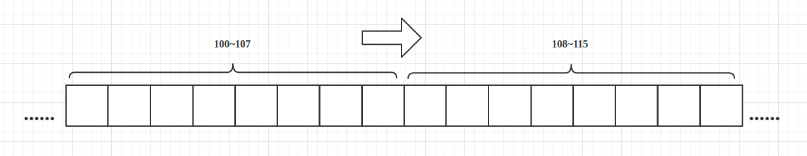
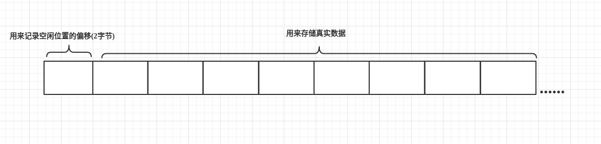
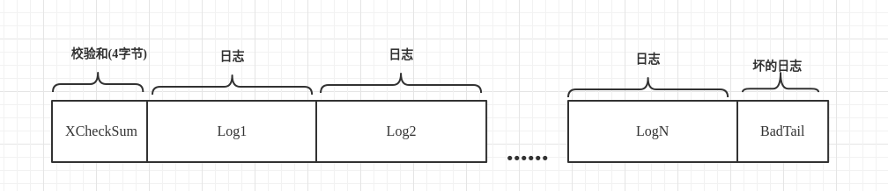
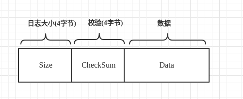
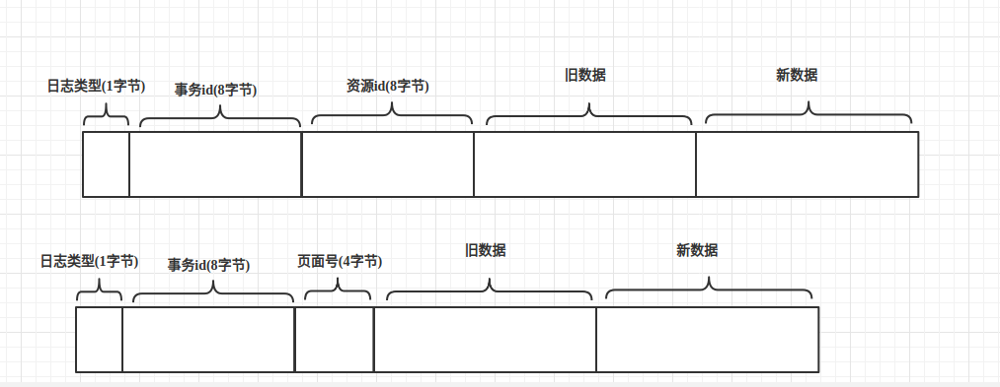
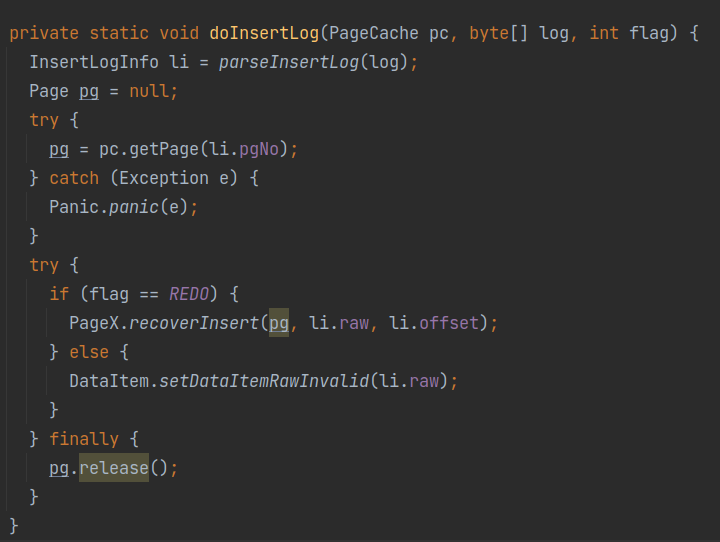
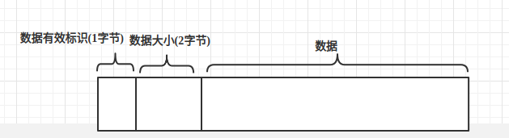

# MYDB
## 1.前言
MYDB是一个Java实现的简单的基于文件的简易版数据库，实现了一些数据库的基本功能。
- 数据的可靠性和数据恢复
- 两段锁协议(2PL)实现可串行化调度
- MVCC
- 两种事务隔离级别(读提交和可重复读)
- 死锁处理
- 简单的表和字段管理
- 简单的SQL解析
- 基于socket的client和server。

整体上分为tm事务控制层，dm数据存储层，vm版本控制层，im索引层，tbm表结构层，transport传输层。
## 2.功能实现
### 2.1.TM(事务控制)
TM通过维护XID文件来维护事务的状态，并提供接口供其他模块来查询某个事务。
#### 2.1.1.xid文件的定义

xid文件的前8个字节，记录事务的个数，事务xid的状态记录在(xid - 1) + 8字节处，每个事务的状态由由一个字节表示，状态分为3种，0代表活跃状态，1代表提交状态，2代表丢弃状态。
```java
  // 事务的三种状态
  private static final byte FIELD_TRAN_ACTIVE = 0;
  private static final byte FIELD_TRAN_COMMITTED = 1;
  private static final byte FIELD_TRAN_ABORTED = 2;
```
xid是从1开始的，而xid为0为超级事务，当一些操作想在没有申请事务的情况下进行，那么可以将操作的XID设置为0。XID为0的事务的状态永远是committed。

TM提供了一些接口供其他模块调用，用来创建事务和查询事务状态的:
```java
  /**开启事务*/
  long begin();

  /**提交事务*/
  void commit(long xid);

  /**丢弃事务(也可以说是回滚)*/
  void abort(long xid);

  boolean isActive(long xid);

  boolean isCommitted(long xid);

  boolean isAborted(long xid);

  /** 用于关闭文件通道和文件资源*/
  void close();
```
#### 2.1.2.实现
整体上所有的方法都是围绕xid文件进行操作的，在这里为了使文件读取更加方便使用的是NIO的FileChannel,每次开启一个事务，xidCounter就会+1，
并且会更新到文件头，来确保其数量正确，并且每次开启一个事务，都会立即刷回到磁盘，防止崩溃。
```java
  @Override
  public long begin() {
    counterLock.lock();
    try {
      long xid = xidCounter + 1;
      updateXID(xid, FIELD_TRAN_ACTIVE);
      incrXIDCounter();
      return xid;
    } finally {
     counterLock.unlock();
    }
  }
```

在创建TransactionManager时，会通过checkXidCounter来判断是否合法。校验方式的话，就是先读取文件头的
8字节来得到其事务的个数，并且可以计算出文件的长度，如果不同则认为XID文件不合法。

而事务的状态则是可以通过xid，来反推出它的位置，读取这个位置的数据，进行判断。
```java
  // 检测XID事务是否处于status状态
  private boolean checkXID(long xid, byte status) {
    long offset = getXidPosition(xid);
    ByteBuffer buf = ByteBuffer.wrap(new byte[XID_FIELD_SIZE]);
    try {
      fc.position(offset);
      fc.read(buf);
    } catch (IOException e) {
      Panic.panic(e);
    }
    return buf.array()[0] == status;
  }

  // 根据事务xid取得其在xid文件对应的位置
  private long getXidPosition(long xid) {
    return LEN_XID_HEADER_LENGTH + (xid - 1) * XID_FIELD_SIZE;
  }

```
### 2.2.计数缓存和共享内存
MYDB中最底层的模块——DataManager;
> DM直接管理数据库DB文件和日志文件。DM的主要职责有:1)分页管理DB文件，并进行缓存;2)
> 管理日志文件，保证在发生错误时可以根据日志进行恢复；3)抽象DB文件为DataItem供上层使用，
> 并提供缓存。

DM的功能总结下来就是两点:上层模块和文件系统之间的一个抽象层，向下提供数据的包装；
向上提供数据的包装；另外就是日志功能。

无论是向上还是向下，DM都提供了一个缓存的功能，用内存来保证效率。

#### 2.3.1.引用计数缓存
很多地方都涉及到缓存，因此这里要涉及一个通用的缓存框架。

而这里，我使用的是引用计数缓存，一般的缓存框架都会采用LRU,实现的时候只需要
实现get(key)方法，释放的方法可以设置一个容量，当达到容量之后自动释放缓存。
但是在这里不太适用。原因呢？可以想象一个场景：当容量满了之后，缓存会自动释放一个内存。
而这个时候上层模块想要把某个资源强制刷回数据源，这个时候发现缓存中没有这个数据。
这个时候就有三种做法：
> 1.不回源。不确定释放的数据是否修改了，如果修改了，那么不回源必然会导致数据的丢失。
>
> 2.回源。回源的话，假设数据没有进行修改，那么此时回源，就白费了。
> 
> 3.放回缓存里。等下次被强制刷回数据源的时候进行回源。看起来没什么问题，但是
> 考虑到如果此时缓存已经满了，意味着必须驱逐一个资源才能放进去。这个时候就会
> 导致缓存抖动。

其实还有一种办法，就是记录数据被修改的时间，那么到下次需要刷回的时候，只需要判断
数据是否被修改即可，但是，这样的做法无非麻烦了很多。

因此，问题的根源是在，LRU缓存，资源被驱逐，上层模块无法感知。因此，可以使用引用计数
策略解决了这个问题，只有当上层模块主动释放引用，缓存在确保没有模块在使用这个资源了，
才会去驱逐资源。

引用计数的话，增加了一个方法release(key)，用于上层模块不使用某个资源时，释放
对资源的引用。当引用归零时，缓存就会驱逐这个资源，刷回到磁盘中。

如果说，缓存满了之后，引用计数无法自动释放内存，那么就应该报错。


#### 2.3.2.实现方式
**get()操作**

AbstractCache<T>是一个抽象类，内部有两个方法，留给实现类实现具体的操作，就是设计模式中的
模板模式，如果某一层想实现缓存功能，只需要实现父类的两个抽象方法即可。
```java
  /**
   * 当资源被驱逐时的写回行为
   * @param obj
   * @throws Exception
   */
  protected abstract void releaseForCache(T obj);


  /**
   * 当资源不在缓存时的获取行为
   * @param key
   * @return
   * @throws Exception
   */
  protected abstract T getForCache(long key) throws  Exception;
```
由于是引用计数，除了必需的缓存功能，也需要维护一个计数。另外，在多线程情况下，要记录
此时是否有其他线程在从数据的资源中获取。因此，需要维护这三个map。
```java
  private HashMap<Long, T> cache; // 实际缓存的数据

  private HashMap<Long, Integer> references; // 元素的引用个数

  private HashMap<Long, Boolean> getting; // 是否正在从数据库获取某资源
```

具体的获取资源的过程是这样的，首先会进入一个死循环，来无限次尝试从缓存里获取。
第一步，判断是否有其他资源正在从资源中进行获取，如果有，那么等待1s后，再过来看看。
```java
    while (true) {
      lock.lock();
      if (getting.containsKey(key)) {
        // 请求的资源正在被其他线程获取
        lock.unlock();
        try {
          Thread.sleep(1);
        } catch (InterruptedException e) {
          e.printStackTrace();
          continue;
        }
        continue;
      }
```

第二步，如果资源已经在缓存中了，那么直接获取并返回，并且给获取的资源的计数器+1.
```java
   if (cache.containsKey(key)) {
     // 资源在缓存中，直接返回
     T obj = cache.get(key);
     references.put(key, references.get(key) + 1);
     lock.unlock();
     return obj;
   }
```

第三步，如果到了这里，则说明需要从数据源中获取，在getting中记录，并count++;
```java
   // 尝试获取该资源
   if (maxResources > 0 && count == maxResources) {
     lock.unlock();
     throw Error.CacheFullException;
   }
   count++;
   getting.put(key, true);
   lock.unlock();
   break;
```

第四步，获取操作，获取成功的话，则将数据放到cache中，并从getting中移除，
并在reference中记录引用次数。
```java
   T obj = null;
   try {
     obj = getForCache(key);
   } catch (Exception e) {
     lock.lock();
     count--;
     getting.remove(key);
     lock.unlock();
     throw e;
   }

   lock.lock();
   getting.remove(key);
   cache.put(key, obj);
   references.put(key, 1);
   lock.unlock();

   return obj;
```

**release()操作**

释放操作比较简单，从reference中减1，如果减到0了，那么就需要刷回数据源，并删除缓存中
的相关结构了。
```java
  protected void release(long key){
    lock.lock();
    try {
      int ref = references.get(key) - 1;
      if (ref == 0) {
        T obj = cache.get(key);
        releaseForCache(obj);
        references.remove(key);
        cache.remove(key);
        count--;
      } else {
        references.put(key, ref);
      }
    } finally {
      lock.unlock();
    }
  }
```

缓存中，应该有一个安全关闭的功能，在关闭时，将缓存中的所有资源强行回源。
```java
 protected void close() {
   lock.lock();
   try {
     Set<Long> keys = cache.keySet();
     for (long key :keys) {
       // 这里关闭，写回资源的时候，无论是否外面引用，都会移除缓存，
       // 如果references == 0,那么就会刷回数据源；否则，直接移除。
       release(key);
       references.remove(key);
       cache.remove(key);
     }
   } finally {
     lock.unlock();
   }
 }
```

#### 2.3.3.共享内存
如果要在内存中更新数据，那么就要找到对应的位置进行修改，而java中执行类似
subArray的操作的时候，只会在底层进行一个复制，无法共用同一个内存。

因此，有一个SubArray类，来规定这个数据的可使用范围。
```java
public class SubArray {
  public byte[] raw;
  public int start;
  public int end;

  public SubArray(byte[] raw, int start, int end) {
    this.raw = raw;
    this.start = start;
    this.end = end;
  }
}
```
### 2.3.数据页的缓存与管理
这里主要是DM模块向下对文件系统的抽象部分。DM将文件系统抽象成页面，每次对
文件系统的读写都是以页面为单位的。同样，从文件系统读进来也是以页面为单位进行缓存的。

#### 2.3.1.页面缓存
这里首先要规定页面大小，和一般数据库一样，数据页大小定为8k。如果想要提升数据库
写入大量数据情况下性能的话，也可以适当增大这个值。

要实现出缓存页面，那肯定要借助之前设计的通用缓存框架。但是，要先定义出
页面的结构。注意这个页面是存储在内存中的，与已经持久化到磁盘的抽象页面
有所区别。

定义一个页面如下：
```java
public class PageImpl implements Page{


  private int pageNumber;

  private byte[] data;

  private boolean dirty;

  private Lock lock;


  // 这里Page的实现类有一个pageCache的引用，是为了方便缓存的获取和释放
  private PageCache pc;
```
其中，pageNumber为页面的页号，该页号从1开始。data就是该数据页实际包含
的字节数据。dirty标志着这个页面是否是脏页面，在缓存驱逐的时候，脏页面需要
被写回磁盘。

定义页面缓存的接口如下：
```java
public interface PageCache {

  public static final int PAGE_SIZE = 1 << 13;  // 默认页面大小为8k

  /**新建页面*/
  int newPage(byte[] initData);
  /**根据页号获取页面*/
  Page getPage(int pgNo) throws Exception;
  /**关闭页面*/
  void close();
  /**释放页面*/
  void release(Page page);


  /**设置最大页，用于截断文件*/
  void truncateByPgNo(int maxPgNo);
  /**获取页面数量*/
  int getPageNumber();
  /**刷回Page*/
  void flushPage(Page pg);
```
页面缓存的具体实现类，需要继承抽象缓存框架，并且实现`getForCache()`和
`releaseForCache()`两个抽象方法。由于这里数据源就是文件系统，`getForCache`
直接从文件中读取，并包裹成Page即可；
```java
  /**
   * 根据pageNumber从数据库文件中读取页数据，并包裹成Page
   * @param key
   * @return
   * @throws Exception
   */
  @Override
  protected Page getForCache(long key) throws Exception {
    int pgNo = (int)key;
    long offset = PageCacheImpl.pageOffset(key);

    ByteBuffer buf = ByteBuffer.allocate(PAGE_SIZE);
    fileLock.lock();
    try {
      fc.position(offset);
      fc.read(buf);
    } catch (IOException e) {
      Panic.panic(e);
    }
    fileLock.unlock();
    return new PageImpl(pgNo, buf.array(), this);
  }
```
而`releaseForCache()`驱逐页面时，也只需要根据页面是否是脏页，来决定
是否需要写回文件系统。
```java
 /**
   * 将脏页刷新到磁盘中
   * @param pg
   */
  @Override
  protected void releaseForCache(Page pg) {
    if (pg.isDirty()) {
      flush(pg);
      pg.setDirty(false);
    }
  }

  /**
   * 用于将页面刷新到文件磁盘
   * @param pg
   */
  private void flush(Page pg) {
    int pgNo = pg.getPageNumber();
    long offset = pageOffset(pgNo);

    fileLock.lock();
    try {
      ByteBuffer buf = ByteBuffer.wrap(pg.getData());
      fc.position(offset);
      fc.write(buf);
      fc.force(false);
    } catch (IOException e) {
      Panic.panic(e);
    } finally {
      fileLock.unlock();
    }
  }
```
从这里可以看出来，同一条数据是不允许跨页存储的。这意味着，单条数据的大小
不能超过数据库页面的大小。
#### 2.3.2.数据页管理
##### 2.3.2.1.第一页
数据库文件的第一页，通常用作一些特殊用途，比如存储一些元数据，用来启动检查
什么的。MYDB的第一页，只是用来做启动检查的。具体的原理是，在每次数据库启动时，
会生成一串随机字节，存储在100～107字节。在数据库正常关闭时，会将这串字节，拷贝
到第一页的108～115字节。


这样数据库在每次启动时，就会检查第一页两处的字节是否相同，以此来判断上一次是否正常关闭。
如果是异常关闭，就需要执行数据的恢复流程(通过日志进行恢复).

启动时设置初始字节：
```java
  public static void setVcOpen(Page pg) {
    pg.setDirty(true);
    setVcOpen(pg.getData());
  }

  private static void setVcOpen(byte[] raw) {
    System.arraycopy(RandomUtil.randomBytes(LEN_VC), 0, raw, OF_VC, LEN_VC);
  }
```
关闭时拷贝字节：
```java
  public static void setVcClose(Page pg) {
    pg.setDirty(true);
    setVcClose(pg.getData());
  }

  private static void setVcClose(byte[] raw) {
    System.arraycopy(raw, OF_VC, raw, OF_VC + LEN_VC, LEN_VC);
  }
```
启动时，校验字节：
```java
  /**
   * 如果是正常关闭的话，那末100～107和108～115字节的字节数组应该是一样的，如果不是的话，则说明没有正常关闭，需要进行恢复操作
   * @param pg
   * @return
   */
  public static boolean checkVc(Page pg) {
    return checkVc(pg.getData());
  }

  private static boolean checkVc(byte[] raw) {
    return Arrays.equals(Arrays.copyOfRange(raw, OF_VC, OF_VC + LEN_VC),
                         Arrays.copyOfRange(raw, OF_VC + LEN_VC, OF_VC + 2 * LEN_VC));
  }
```
##### 2.3.2.2.普通页
MYDB在普通数据页的管理比较简单。一个普通页面以一个2字节无符号数起始，表示
这一页的空闲位置的偏移。剩下的部分都是实际存储的数据。

所以对普通页的管理，基本都是围绕对FSO(Free Space Offset)进行的。例如
向页面插入数据：
```java
  /**
   * 将raw插入pg中，返回插入位置
   * @param pg
   * @param raw
   * @return
   */
  public static short insert(Page pg, byte[] raw) {
    pg.setDirty(true);
    short offset = getFSO(pg.getData());
    System.arraycopy(raw, 0, pg.getData(), offset, raw.length);
    setFSO(pg.getData(), (short) (offset + raw.length));
    return offset;
  }

```
在写入之前获取FSO，来确定写入的位置，并在写入后更新FSO。FSO的操作如下：
```java
 /**
   * 设置空闲位置的偏移量
   * @param raw
   * @param ofData
   */
  private static void setFSO(byte[] raw, short ofData) {
    System.arraycopy(Parser.short2Byte(ofData), 0, raw, OF_FREE, OF_DATA);
  }

  /**
   * 获得该页空闲位置的偏移量
   * @param pg
   * @return
   */
  public static short getFSO(Page pg) {
    return getFSO(pg.getData());
  }

  private static short getFSO(byte[] raw) {
    return Parser.parseShort(Arrays.copyOfRange(raw, OF_FREE, OF_DATA));
  }

  /**
   * 获得页面的空闲空间大小
   * @param pg
   * @return
   */
  public static int getFreeSpace(Page pg) {
    return PageCache.PAGE_SIZE - (int)getFSO(pg.getData());
  }

```
其次，PageX中有两个需要用到的函数是`recoverInsert()`和`recoverUpdate()`
用于在数据库崩溃后重新打开时，恢复例程直接插入数据以及修改数据使用。(日志恢复中
会使用到)
```java
 /**
   * 将raw插入pg中的offset位置，并将pg的offset设置为较大的offset
   * @param pg
   * @param raw
   * @param offset
   */
  public static void recoverInsert(Page pg, byte[] raw, short offset) {
    pg.setDirty(true);
    System.arraycopy(raw, 0, pg.getData(), offset, raw.length);

    short rawFSO = getFSO(pg.getData());
    if (rawFSO < offset + raw.length) {
      setFSO(pg.getData(), (short) (offset + raw.length));
    }
  }

  /**
   * 将raw插入pg的offset位置，不更新空闲位置的偏移量
   * @param pg
   * @param raw
   * @param offset
   */
  public static void recoverUpdate(Page pg, byte[] raw, short offset) {
    pg.setDirty(true);
    System.arraycopy(raw, 0, pg.getData(), offset, raw.length);
  }
```
### 2.4.日志文件与恢复策略
MYDB提供了崩溃后的数据恢复功能。DM层在每次对底层数据操作时，都会记录一条日志
到磁盘上。在数据库崩溃之后，再次启动时，可以根据日志的内容，恢复数据文件，保证其一致性。
#### 2.4.1.日志读写
日志的二进制文件，按照如下的格式进行排布：

其中XCheckNum是一个四字节的整数，是对后续所有日志计算的校验和。Log1~LogN
是常规的日志数据，BadTail是在数据库崩溃时，没有来得及写完的日志数据，这个BadTail
不一定存在。

每条日志的格式如下：



其中，Size是一个四字节整数，标识了Data段的字节数。CheckSum则是该条日志的校验和。

单条日志的校验和，其实就是通过一个指定的种子实现的。
```java
  private int calCheckSum(int xCheck, byte[] log) {
    for (byte b : log) {
      xCheck = xCheck * SEED + b;
    }
    return xCheck;
  }
```
这样，对所有日志求出校验和，求和就能得到日志文件的校验和了。

Logger被实现成迭代器模式，通过`next()`方法，不断地从文件读出下一条日志，并将
其中的Data解析出来并返回。`next()`方法的实现主要依赖`internNext()`，大致如下，其中
position是当前日志文件读到的位置偏移。
```java
private byte[] internNext() {
    // 这个position是应该从第一条日志，也就是position=4的时候开始计算,在rewind()方法中验证了这一点
    if (position + OF_DATA >= fileSize) {
      return null;
    }
    // 读取size
    ByteBuffer tmp = ByteBuffer.allocate(4);
    try {
      fc.position(position);
      fc.read(tmp);
    } catch (IOException e) {
      Panic.panic(e);
    }
    int size = Parser.parseInt(tmp.array());
    if (position + size + OF_DATA > fileSize) {
      return null;
    }
    ByteBuffer buf = ByteBuffer.allocate(OF_DATA + size);
    try {
      fc.position(position);
      fc.read(buf);
    } catch (IOException e) {
      Panic.panic(e);
    }

    byte[] log = buf.array();
    int checkSum1 = calCheckSum(0, Arrays.copyOfRange(log, OF_DATA, log.length)); // 根据data计算出校验值
    int checkSum2 = Parser.parseInt(Arrays.copyOfRange(log, OF_CHECKSUM, OF_DATA)); // 再取出日志中的校验值
    if (checkSum1 != checkSum2) {
      return null;
    }
    position += log.length;
    return log;
  }
```
在打开一个日志文件时，需要首先校验日志文件的XCheckSum,并移除文件尾部
可能存在的BadTail,由于BadTail该条日志尚未写入完成，文件的校验和也就不会
包含该日志的校验和，去掉BadTail即可保证日志文件的一致性。
```java
private void checkAndRemoveTail() {
    rewind();

    int xCheck = 0;
    while (true) {
      byte[] log = internNext();
      if (log == null) break;
      xCheck = calCheckSum(xCheck, log);
    }
    if (xCheck != xCheckSum) {
      Panic.panic(Error.BadXidFileException);
    }

    try {
      truncate(position); // 截断后面的坏的日志
    } catch (Exception e) {
      Panic.panic(e);
    }
    try {
      file.seek(position);
    } catch (IOException e) {
      Panic.panic(e);
    }
    rewind();
  }
```
向日志文件写入日志时，也是首先将数据包裹成日志格式，写入文件后，再更新
文件的校验和，更新校验和时，会刷新缓存区，保证内容写入磁盘。
```java
  public void log(byte[] data) {
   byte[] log = wrap(data);
   ByteBuffer buf = ByteBuffer.wrap(log);
   lock.lock();
   try {
     fc.position(fc.size());
     fc.write(buf);
   } catch (IOException e) {
      Panic.panic(e);
   } finally {
     lock.unlock();
   }
     updateXCheckSum(log);
  }

/**
 * 更新总的日志文件的checkSum
 * @param log
 */
  private void updateXCheckSum(byte[] log) {
   this.xCheckSum = calCheckSum(this.xCheckSum, log);
   try {
    fc.position(0);
    fc.write(ByteBuffer.wrap(Parser.int2Byte(xCheckSum)));
   } catch (IOException e) {
     Panic.panic(e);
   }
 }

  private byte[] wrap(byte[] data) {
   byte[] checkSum = Parser.int2Byte(calCheckSum(0, data));
   byte[] size = Parser.int2Byte(data.length);
   return Bytes.concat(size, checkSum, data);
  }

```
#### 2.4.2.恢复策略
DM为上层模块，提供了两种策略，分别是插入新数据(I)和更新现有数据(U)，
删除数据在VM层进行实现。

DM的日志策略：

在进行I和U操作之前，必须先进行对应的日志操作，在保证日志写入磁盘后，才能进行
数据操作。

这个日志策略，使得DM对于数据操作的磁盘同步，可以更加随意。日志在数据操作
之前，保证到达了磁盘，那么即使该数据最后没有来得及同步到磁盘，数据库
就发生了崩溃，后续也可以通过磁盘上的日志恢复该数据。

对于两种数据操作，DM记录的日志如下：
> (Ti,I,A,x),表示事务Ti在A位置插入了一条数据x
> 
> (Ti,U,A,oldx,newx),表示事务Ti将A位置的数据，从oldx更新成newx

##### 2.4.2.1.单线程
由于单线程，Ti，Tj和Tk的日志永远不会相交。这种情况日志恢复很简单，假设
日志中的最后一个事务是Ti:
> 1.对Ti之前所有的事务的日志，进行恢复
> 
> 2.接着检查Ti的状态(XID)文件，如果Ti的状态是已完成(包括committed和aborted)，
> 就将Ti重做(redo)，否则进行撤销(undo)

对事务进行redo:
> 1.正序扫描事务T的所有日志
> 
> 2.如果日志是插入操作(Ti,I,A,x)，就将x重新插入A位置
> 
> 3.如果日志是更新操作(Ti,U,A,oldx,newx)，就将A位置的值设置为newx

对事务进行undo:
> 1.倒序扫描事务T的所有日志
> 
> 2.如果日志是插入操作(Ti,I,A,x),就将A位置的数据进行删除
> 
> 3.如果日志是更新操作(Ti,U,A,oldx,newx),就将A位置的值设置为oldx

MYDB中没有真正的删除操作，对于插入操作的undo，只是将其中的标志位设置为invalid。

##### 2.4.2.2.多线程
在多线程的情况下，如果两个事务在同时进行操作，那么如果是要进行回滚，
就需要级联回滚，但是有时候committed的事务，应当被持久化，就会造成矛盾。
因此这里需要保证:
> 规定1：正在进行的事务，不会读取其他任何未提交的事务产生的数据。
> 
> 规定2：正在进行的事务，不会修改其他任何未提交的事务修改或产生的数据。


因此，出现了VM层，在MYDB中，由于VM的存在，传递到DM层，真正执行的操作
序列，都可以保护规定1和规定2。有了VM层的限制，并发情况下日志的恢复就很简单了：
> 1.重做所有崩溃时已完成(committed或aborted)的事务
> 
> 2.撤销所有崩溃未完成(active)的事务

在恢复后，数据库就会恢复到所有已完成事务结束，所有未完成事务尚未开始的状态。
##### 2.4.2.3.实现
首先规定两种日志的格式：
```java
  private static final byte LOG_TYPE_INSERT = 0; // 插入日志的标识符

  private static final byte LOG_TYPE_UPDATE = 1; // 更新日志的标识符
```

跟原理中描述的类似，recover过程主要也是两步：重做所有已完成事务，撤销所有
未完成事务：
```java
  private static void redoTransactions(TransactionManager tm, Logger lg, PageCache pc) {
    lg.rewind();
    while(true) {
      byte[] log = lg.next();
      if (log == null) break;
      if (isInsertLog(log)) {
          InsertLogInfo li = parseInsertLog(log);
          long xid = li.xid;
          if (!tm.isActive(xid)) {
            doInsertLog(pc, log, REDO);
          }
      } else {
        UpdateLogInfo xi = parseUpdateLog(log);
        long xid = xi.xid;
        if (!tm.isActive(xid)) {
          doUpdateLog(pc, log, REDO);
        }
      }
    }
  }

  private static void undoTransactions(TransactionManager tm, Logger lg, PageCache pc) {
    Map<Long, List<byte[]>> logCache = new HashMap<>();
    lg.rewind();
    while (true) {
      byte[] log = lg.next();
      if (log == null) break;
   
      if (isInsertLog(log)) {
         InsertLogInfo li = parseInsertLog(log);
         long xid = li.xid;
         if (tm.isActive(xid)) {
         if (!logCache.containsKey(xid)) {
           logCache.put(xid, new ArrayList<>());
         }
        logCache.get(xid).add(log);
       }
      } else {
         UpdateLogInfo xi = parseUpdateLog(log);
         long xid = xi.xid;
         if (tm.isActive(xid)) {
         if (!logCache.containsKey(xid)) {
           logCache.put(xid, new ArrayList<>());
         }
         logCache.put(xid, new ArrayList<>());
       }
      }
    }
 
    // 对所有的active log进行倒序undo
    for (Entry<Long, List<byte[]>> entry : logCache.entrySet()) {
      List<byte[]> logs = entry.getValue();
      for (int i = logs.size() - 1; i >= 0; i--) {
      byte[] log = logs.get(i);
      if (isInsertLog(log)) {
         doInsertLog(pc, log, UNDO);
      } else {
         doUpdateLog(pc, log, UNDO);
      }
    }
  }
 }
```

updateLog和insertLog的重做和撤销处理，分别合成一个方法来实现。
```java
  private static void doUpdateLog(PageCache pc, byte[] log, int flag) {
    int pgNo;
    short offset;
    byte[] raw;
    if (flag == REDO) {
      UpdateLogInfo xi = parseUpdateLog(log);
      pgNo = xi.pgNo;
      offset = xi.offset;
      raw = xi.newRaw;
    } else {
      UpdateLogInfo xi = parseUpdateLog(log);
      pgNo = xi.pgNo;
      offset= xi.offset;
      raw = xi.oldRaw;
    }
    Page pg = null;
    try {
      pg = pc.getPage(pgNo);
    } catch (Exception e) {
      Panic.panic(e);
    }
    try {
      PageX.recoverUpdate(pg, raw, offset);
    } finally {
      pg.release();
    }
  }
```
```java
  private static void doInsertLog(PageCache pc, byte[] log, int flag) {
    InsertLogInfo li = parseInsertLog(log);
    Page pg = null;
    try {
      pg = pc.getPage(li.pgNo);
    } catch (Exception e) {
      Panic.panic(e);
    }
    try {
      if (flag == REDO) {
        PageX.recoverInsert(pg, li.raw, li.offset);
      } else {
        DataItem.setDataItemRawInvalid(li.raw);
      }
    } finally {
      pg.release();
    }
  }
```

注意，`doInsertLog()`方法中的删除，使用的是` DataItem.setDataItemRawInvalid(li.raw);`,
大致的作用，就是将该条DataItem的有效位设置为无效，来进行逻辑删除。
### 2.5.页面索引与DM的实现
这里是DM的最后一个环节，设计一个简单的页面索引。并且实现了DM层对于
上层的抽象：DataItem。
#### 2.5.1.页面索引
页面索引，缓存了每一页的空闲空间。用于在上层模块进行插入时，能够快速
找到一个合适空间的页面，而无需从磁盘或者缓存检查每一个页面的信息。

MYDB是将一页的空间划分成了40个区间。在启动时，就会遍历所有的页面信息，
获取页面的空闲空间，安排到这40个区间中。insert请求一个页时，会首先将所需
的空间向上取整，映射到某一个区间，随后取出这个区间的任何一页，都可以满足需求。

pageIndex的实现，就是利用一个List类型的数组。
```java
 // 将一页化成40个空间
  private static final int INTERVALS_NO = 40;
  private static final int THRESHOLD = PageCache.PAGE_SIZE / INTERVALS_NO;

  private List<PageInfo>[] lists;
```
从PageIndex中获取页面也很简单，算出区间号，直接取出即可；
```java
  public PageInfo select(int spaceSize) {
    lock.lock();
    try {
      int number = spaceSize / THRESHOLD;
      if (number < INTERVALS_NO) number++;  // 对计算出的区间向上取整
      while (number <= INTERVALS_NO) {
        if (lists[number].size() == 0) { // 如果计算出的区间大小没有合适的，那么就加，找到更大的区间
          number++;
          continue;
        }
        return lists[number].remove(0); // 找到后，会将整个页面移出，避免并发操作，这里肯定是每个页面只被添加了一次
      }
      return null;
    } finally {
      lock.unlock();
    }
  }
```
返回的PageInfo包含页号和空闲空间大小的信息。

可以看到，被选择的页，会直接从PageIndex中移除，这意味着，同一个页面时不允许
并发写的。在上层模块使用完这个页面后，需要将其重新插入PageIndex;
```java
  public void add(int pgNo, int freeSpace) {
    lock.lock();
    try {
      int number = freeSpace / THRESHOLD;
      lists[number].add(new PageInfo(pgNo, freeSpace));
    } finally {
      lock.unlock();
    }
  }
```
在DataManager被创建时，需要获取所有页面并填充PageIndex;
```java
 // 初始化pageIndex
  void fillPageIndex() {
    int pageNumber = pc.getPageNumber();
    for (int i = 2; i <= pageNumber; i++) {
      Page pg = null;
      try {
        pg = pc.getPage(i);
      } catch (Exception e) {
        Panic.panic(e);
      }
      pIndex.add(pg.getPageNumber(), PageX.getFreeSpace(pg));
      pg.release();
    }
  }
```
在使用完Page后需要及时release，否则可能会撑爆缓存。
#### 2.5.2.DataItem
DataItem是DM层向上层提供的数据抽象。上层模块通过地址，向DM请求到对应的
DataItem，再获取到其中的数据。

DataItem的实现：
```java
public class DataItemImpl implements DataItem {
  private SubArray raw;
  private byte[] oldRaw;  // 旧数据，和普通数据一样，包括ValidFlag/DataSize/Data
  private DataManagerImpl dm;
  private long uid;
  private Page pg;
```
保存一个dm的引用是因为其释放依赖dm的释放(dm同时实现了缓存接口，用于缓存
DataItem),以及修改数据时落地日志。

DataItem中保存的数据，结构如下：


其中ValidFlag占用1字节，标识了该DataItem是否有效。删除一个DataItem
，只需要简单地将其有效位置设置为0。DataSize占用2字节，标识了后面Data
的长度。

上层模块在获取到DataItem后，可以通过`data()`方法，该方法返回的数组
是数据共享的，而不是拷贝实现的，所以使用了SubArray。
```java
  @Override
  public SubArray data() {
    return new SubArray(raw.raw, raw.start + OF_DATA, raw.end);
  }
```
在上层模块试图对DataItem进行修改时，需要遵循一定的流程：在修改之前需要调用
`before()`方法，想要撤销修改时，调用`unBefore()`方法，在修改完成后，调用
`after()`方法。整个流程，主要是为了保存前相数据，并及时落地日志。DM
会保证对DataItem的修改是原子性的。
```java
@Override
  public void before() {
    wLock.lock();
    pg.setDirty(true);
    System.arraycopy(raw.raw, raw.start, oldRaw,0, oldRaw.length); // 这里的拷贝，我猜测是整体上拷贝，修改一部分，也会全部拷贝
  }

  @Override
  public void unBefore() {
    System.arraycopy(oldRaw, 0, raw.raw, raw.start, oldRaw.length);
    wLock.unlock();
  }

  @Override
  public void after(long xid) {
    dm.logDataItem(xid, this);
    wLock.unlock();
  }
```
`after()`方法，主要就是调用dm中的一个方法，对修改操作落日志。

在使用完DataItem后，应该及时调用release()方法，释放掉DataItem的缓存
```java
  @Override
  public void release() {
    dm.releaseDataItem(this);
  }
```
#### 2.5.3.DM的实现
DataManager是DM层直接对外提供方法的类，同时，也实现成DataItem对象的
缓存。DataItem存储的key，是由页号和页内偏移组成的一个8字节无符号整数，
页号和偏移各占4字节。

DataItem缓存，`getForCache()`,只需要从key中解析出页号，从pageCache中获取
到页面，再根据偏移，解析出DataItem即可。
```java
  @Override
  protected DataItem getForCache(long uid) throws Exception {
    short offset = (short)(uid & ((1L << 16) - 1)); // offset占后两个字节
    uid >>>= 32;
    int pgNo = (int)(uid & ((1L << 32) - 1)); // pgNo占前四个字节
    Page pg = pc.getPage(pgNo);
    return DataItem.parseDataItem(pg, offset, this);
  }
```
DataItem缓存释放，需要将DataItem写回数据源，由于对文件的读写是以页为单位
进行的，只需要将DataItem所在的页release即可：
```java
  @Override
  protected void releaseForCache(DataItem di) {
    di.page().release();
  }
```
从已有文件创建DataManager和从空文件创建DataMangaer的流程稍有不同，除了
PageCache和Logger的创建方式有所不同以外，从空文件创建首先需要对第一页
进行初始化，而从已有文件创建，则是需要对第一页进行校验，来判断是否需要执行
恢复流程。并重新对第一页生成随机字节。
```java
 public static DataManager create(String path, long mem, TransactionManager tm) {
    PageCache pc = PageCache.create(path, mem);
    Logger lg = Logger.create(path);

    DataManagerImpl dm = new DataManagerImpl(pc, lg, tm);
    dm.initPageOne();
    return dm;
  }

  public static DataManager open(String path, long mem, TransactionManager tm) {
    PageCache pc = PageCache.open(path, mem);
    Logger lg = Logger.open(path);
    DataManagerImpl dm = new DataManagerImpl(pc, lg, tm);
    if (!dm.loadCheckPageOne()) {
      Recover.recover(tm, lg, pc);
    }
    dm.fillPageIndex();
    PageOne.setVcOpen(dm.pageOne);
    dm.pc.flushPage(dm.pageOne);

    return dm;
  }
```
其中，初始化第一页，和校验第一页，都是调用PageOne类中的方法实现的：
```java
// 在创建文件时初始化pageOne
  void initPageOne() {
    int pgNo = pc.newPage(PageOne.InitRaw());
    assert pgNo == 1;
    try {
      pageOne = pc.getPage(pgNo);
    } catch (Exception e) {
      Panic.panic(e);
    }
    pc.flushPage(pageOne);
  }

  // 在打开已有文件时读入PageOne，并验证正确性
  public boolean loadCheckPageOne() {
    try {
      pageOne = pc.getPage(1);
    } catch (Exception e) {
      Panic.panic(e);
    }
    return PageOne.checkVc(pageOne);
  }
```
 DM层提供了三个功能供上层使用，分别是读，插入和修改。修改是通过读出的
 DataItem实现的，于是，DataManager只需要提供`read()`和`insert()`
 方法。
 
`read()`根据UID从缓存中获取DataItem，并校验有效位：
```java
  @Override
  public DataItem read(long uid) throws Exception {
    DataItemImpl di = (DataItemImpl) super.get(uid);
    if (!di.isValid()) {
      di.release();
      return null;
    }
    return di;
  }
```
`insert()`方法，在pageIndex中获取一个足以存储插入内容的页面的页号，
获取页号后，首先需要写入插入日志，接着才可以通过PageX插入数据，并返回
插入位置的偏移量。最后需要将页面信息重新插入pageIndex.
```java
  @Override
  public long insert(long xid, byte[] data) throws Exception {
    byte[] raw = DataItem.wrapDataItemRaw(data);
    if (raw.length > PageX.MAX_FREE_SPACE) {
      throw Error.DataToolLargeException;
    }

    // 尝试获取可用页
    PageInfo pi = null;
    for (int i = 0; i < 5; i++) {
      pi = pIndex.select(raw.length);
      if (pi != null) {
        break;
      } else {
        int newPage = pc.newPage(PageX.initRaw());
        pIndex.add(newPage, PageX.MAX_FREE_SPACE);
      }
    }
    if (pi == null) {
      throw Error.DataToolLargeException;
    }

    Page pg = null;
    int freeSpace = 0;
    try {
      pg = pc.getPage(pi.pgNo);
      // 首先做日志
      byte[] log = Recover.insertLog(xid, pg, raw);
      logger.log(log);

      // 再执行插入操作
      short offset = PageX.insert(pg, raw);

      pg.release();
      return Types.addressToUid(pi.pgNo, offset);

    } finally {
      // 将取出的pg重新插入pIndex
      if (pg != null) {
        pIndex.add(pi.pgNo, PageX.getFreeSpace(pg));
      } else {
        pIndex.add(pi.pgNo, freeSpace);
      }
    }
  }
```
DataManager正常关闭时，需要执行缓存和日志的关闭流程，并且要设置第一页的
字节校验。
```java
  @Override
  public void close() {
    super.close();
    logger.close();

    PageOne.setVcClose(pageOne);
    pageOne.release();
    pc.close();
  }
```
### 2.6.记录的版本与事务隔离
> VM基于两段锁协议实现了调度序列的可串行化，并实现了MVCC以消除读写阻塞。同时
实现了两种隔离级别。

类似于DataManager是MYDB的数据管理核心，VersionManager是MYDB的事务和数据
版本的管理核心。
#### 2.6.1.2PL与MVCC
##### 2.6.1.1.冲突与2PL
数据库中的冲突，如果只考虑更新操作(U)和读操作(R)，两个操作只要满足下面
三个条件，就可以说这两个操作相互冲突：
> 1.这两个操作是由不同的事务执行
> 
> 2.这两个操作 操作的是同一个数据项
> 
> 3.这两个操作至少有一个是更新操作

那么这样，对同一个数据操作的冲突，就有两种情况:
> 1.两个不同事务的U操作冲突
>
> 2.两个不同事务的U/R操作冲突

冲突或者不冲突的影响在于，交换两个互不冲突的操作的顺序，不会对最终的结果
造成影响，而交换两个冲突操作的顺序，则是会造成影响的。

因此，VM的一个很重要的职责，就是实现了调度序列的可串行化。MYDB采用两段
锁协议(2PL)来实现。当采用2PL时，如果某个事务i已经对x加锁，且另一个事务j
也想操作x，但是这个操作与事务i之前的操作相互冲突的话，事务j就会被阻塞。
譬如，T1已经因为U1(x)锁定了x，那么T2对x的读或者写操作都会被阻塞，T2必须
等待T1释放掉对x的锁。

由此看来，2PL确实保证了调度序列的可串行化，但是不可避免地导致了事务的相互阻塞，
甚至可能导致死锁。MYDB为了提供事务处理的效率，降低阻塞概率，实现了MVCC。

