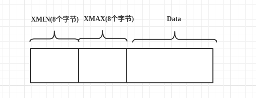
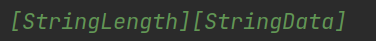
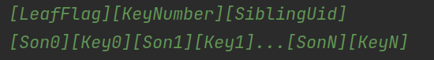
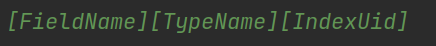
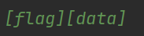

# MYDB
## 1.前言
MYDB是一个Java实现的简单的基于文件的简易版数据库，实现了一些数据库的基本功能。
- 数据的可靠性和数据恢复
- 两段锁协议实现可串行化调度
- MVCC
- 两种事务隔离级别
- 死锁处理
- 简单的表和字段管理
- SQL解析
- 基于socket的client和server。

整体上分为tm事务控制层，dm数据存储层，vm版本控制层，im索引层，tbm表结构层，transport传输层。
## 2.功能实现
### 2.2.TM(事务控制)
TM通过维护XID文件来维护事务的状态，并提供接口供其他模块来查询某个事务。
#### 2.2.1.xid文件的定义

xid文件的前8个字节，记录事务的个数，事务xid的状态记录在(xid - 1) + 8字节处，每个事务的状态由由一个字节表示，状态分为3种，0代表活跃状态，1代表提交状态，2代表丢弃状态。

xid是从1开始的，而xid为0为超级事务，当一些操作想在没有申请事务的情况下进行，那么可以将操作的XID设置为0。XID为0的事务的状态永远是committed。

TM提供了一些接口供其他模块调用，用来创建事务和查询事务状态的:

#### 2.2.2.实现
整体上所有的方法都是围绕xid文件进行操作的，在这里为了使文件读取更加方便使用的是NIO的FileChannel,每次开启一个事务，xidCounter就会+1，
并且会更新到文件头，来确保其数量正确，并且每次开启一个事务，都会立即刷回到磁盘，防止崩溃。

在创建TransactionManager时，会通过checkXidCounter来判断是否合法。校验方式的话，就是先读取文件头的
8字节来得到其事务的个数，并且可以计算出文件的长度，如果不同则认为XID文件不合法。

而事务的状态则是可以通过xid，来反推出它的位置，读取这个位置的数据，进行判断。

### 2.3.计数缓存和共享内存
MYDB中最底层的模块——DataManager;
> DM直接管理数据库DB文件和日志文件。DM的主要职责有:1)分页管理DB文件，并进行缓存;2)
> 管理日志文件，保证在发生错误时可以根据日志进行恢复；3)抽象DB文件为DataItem供上层使用，
> 并提供缓存。

DM的功能总结下来就是两点:上层模块和文件系统之间的一个抽象层，向下提供数据的包装；
向上提供数据的包装；另外就是日志功能。

无论是向上还是向下，DM都提供了一个缓存的功能，用内存来保证效率。

#### 2.3.1.引用计数缓存
很多地方都涉及到缓存，因此这里要涉及一个通用的缓存框架。

而这里，我使用的是引用计数缓存，一般的缓存框架都会采用LRU,实现的时候只需要
实现get(key)方法，释放的方法可以设置一个容量，当达到容量之后自动释放缓存。
但是在这里不太适用。原因呢？可以想象一个场景：当容量满了之后，缓存会自动释放一个内存。
而这个时候上层模块想要把某个资源强制刷回数据源，这个时候发现缓存中没有这个数据。
这个时候就有三种做法：
> 1.不回源。不确定释放的数据是否修改了，如果修改了，那么不回源必然会导致数据的丢失。
>
> 2.回源。回源的话，假设数据没有进行修改，那么此时回源，就白费了。
> 
> 3.放回缓存里。等下次被强制刷回数据源的时候进行回源。看起来没什么问题，但是
> 考虑到如果此时缓存已经满了，意味着必须驱逐一个资源才能放进去。这个时候就会
> 导致缓存抖动。

其实还有一种办法，就是记录数据被修改的时间，那么到下次需要刷回的时候，只需要判断
数据是否被修改即可，但是，这样的做法无非麻烦了很多。

因此，问题的根源是在，LRU缓存，资源被驱逐，上层模块无法感知。因此，可以使用引用计数
策略解决了这个问题，只有当上层模块主动释放引用，缓存在确保没有模块在使用这个资源了，
才会去驱逐资源。

引用计数的话，增加了一个方法release(key)，用于上层模块不使用某个资源时，释放
对资源的引用。当引用归零时，缓存就会驱逐这个资源，刷回到磁盘中。

如果说，缓存满了之后，引用计数无法自动释放内存，那么就应该报错。

#### 2.3.2.实现方式
**get()操作**

AbstractCache<T>是一个抽象类，内部有两个方法，留给实现类实现具体的操作，就是设计模式中的
模板模式，如果某一层想实现缓存功能，只需要实现父类的两个抽象方法即可。

由于是引用计数，除了必需的缓存功能，也需要维护一个计数。另外，在多线程情况下，要记录
此时是否有其他线程在从数据的资源中获取。因此，需要维护这三个map。

具体的获取资源的过程是这样的，首先会进入一个死循环，来无限次尝试从缓存里获取。
第一步，判断是否有其他资源正在从资源中进行获取，如果有，那么等待1s后，再过来看看。

第二步，如果资源已经在缓存中了，那么直接获取并返回，并且给获取的资源的计数器+1.

第三步，如果到了这里，则说明需要从数据源中获取，在getting中记录，并count++;

第四步，获取操作，获取成功的话，则将数据放到cache中，并从getting中移除，
并在reference中记录引用次数。

**release()操作**

释放操作比较简单，从reference中减1，如果减到0了，那么就需要刷回数据源，并删除缓存中
的相关结构了。

缓存中，应该有一个安全关闭的功能，在关闭时，将缓存中的所有资源强行回源。

#### 2.3.3.共享内存
如果要在内存中更新数据，那么就要找到对应的位置进行修改，而java中执行类似
subArray的操作的时候，只会在底层进行一个复制，无法共用同一个内存。

因此，有一个SubArray类，来规定这个数据的可使用范围。

